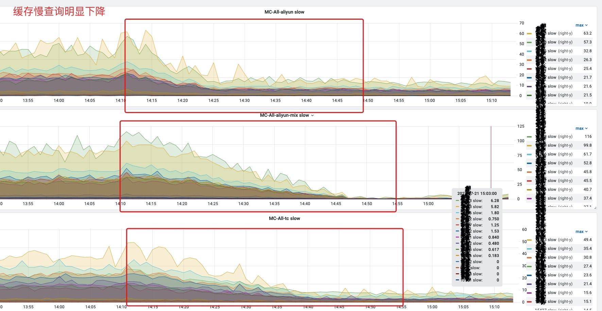
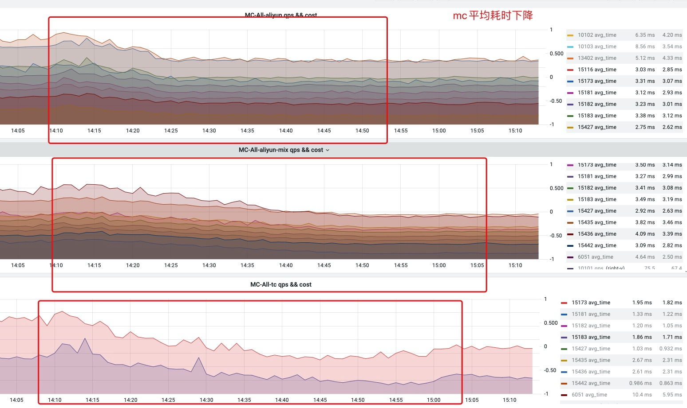
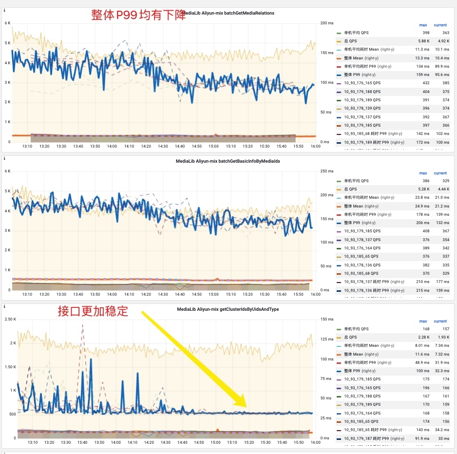
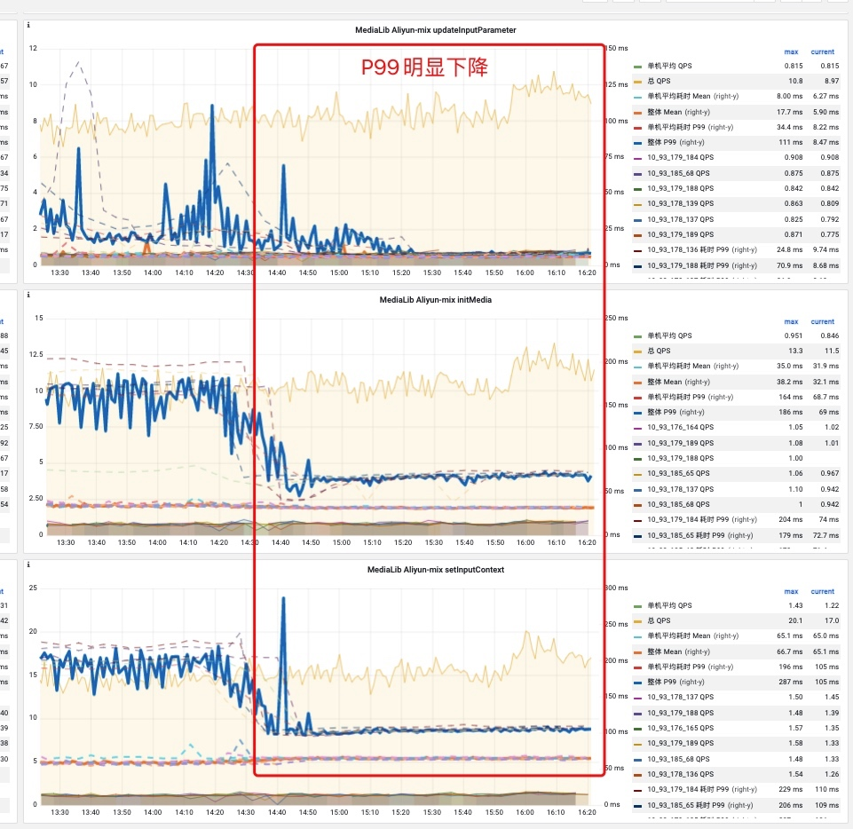
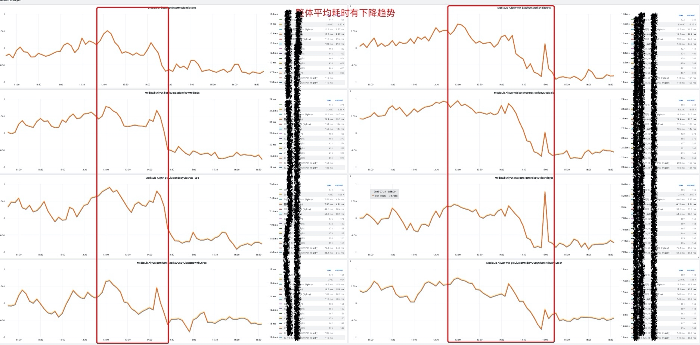

# 服务升级Java17总结

> 微博视频媒体库作为微博视频服务的统一存储服务,上行承载微博视频发布,视频集合,下行支持视频播放,以及关系流,人们流中视频数据的出口,服务总QPS能够达到20-30万的量,之前线上使用的`Java8 + G1垃圾回收器`, 垃圾停顿时间基本上在 100-300ms之间, 对媒体库接口会出现偶发超时,因为非强引用过多导致间隔性长时间GC进行了优化(开启了并行回收,并增加非强引用线程数)
> 
> 为了紧跟时代并且想通过Java17运行时环境+ ZGC 解决媒体库遇到的接口P99会出现性能毛刺问题, 看下是否能能够优化,升级过程中遇到的各种问题以及最后收益情况

## 前置项目改造注意事项

运行时环境升级到Java17需要对项目中依赖的不兼容的jar包做改造,总结来讲有两大类
 
- 1. sun包的问题(`The sun.* packages are not part of the supported, public interface.`)
    - 最典型的是`sun.misc.BASE64Encoder`该包弃用了,需要修改其替代的类`java.util.Base64`详情见 [Why Developers Should Not Write Programs That Call 'sun' Packages](https://www.oracle.com/java/technologies/faq-sun-packages.html)
- 2. 反射的使用姿势问题
    - 例如 redisson客户端,升级对应的版本即可
    - 如果还希望使用反射的API(`setAccessible(true)`)去获取非公有的fields, 在启动时需要配置 JVM 参数 `--add-opens=java.base/java.lang.reflect=ALL-UNNAMED`，否则无法正常工作。原因可参考 [Migrating From JDK 8 to Later JDK Releases, Strong Encapsulation in the JDK, --add-opens](https://docs.oracle.com/en/java/javase/17/migrate/migrating-jdk-8-later-jdk-releases.html#GUID-12F945EB-71D6-46AF-8C3D-D354FD0B1781).

各项参数配置

Java17使用的版本为`17.0.1`,采用ZGC作为垃圾回收器,gc参数配置如下

机器配置: 16核CPU, 32G内存机器

```
ENV CATALINA_HEAP="-Xmx8g -Xms8g -Xmn4g -Xss1m  -Dlog4j2.formatMsgNoLookups=true"
# catalina for java17 start
ENV CATALINA_GC -XX:ReservedCodeCacheSize=256m -XX:InitialCodeCacheSize=256m -XX:+UnlockExperimentalVMOptions -XX:+UseZGC -XX:ConcGCThreads=2 -XX:ParallelGCThreads=6 -XX:ZCollectionInterval=5 -XX:ZAllocationSpikeTolerance=5 -XX:+UnlockDiagnosticVMOptions -XX:-ZProactive
ENV CATALINA_LOG -Xlog:safepoint,classhisto*=trace,age*,gc*=info:file=../gclogs/gc-%t.log:time,tid,tags:filecount=5,filesize=50m
ENV CATALINA_EXTRA --add-opens=java.base/java.lang.reflect=ALL-UNNAMED
# catalina for java17 end
```

附上相关参数自查 [传送门](https://docs.oracle.com/en/java/javase/17/docs/specs/man/java.html)

## 1.Java17+ZGC垃圾回收器线上假死问题
### 问题描述:
线上机器接流量一段时间后,出现假死现象,进程无响应,**并且无法进行jstack留下堆栈情况**, 这就导致无法知道hang死的时候整个JVM堆的状态,也没办法通过分析是否有死锁?是否是内存泄漏等问题, 所以唯一的入手点是GC日志,以及尝试再次复现

**GC日志中关键日志有如下两类较明显的关键词**
-  `Allaction stall`
-  `ICBufferFull`

    日志样例:
```
[2022-05-27T16:57:00.154+0800][1129][gc          ] Allocation Stall (NettyServer-10.93.179.178:8004-6-thread-74) 138.946ms
[2022-05-27T16:57:00.154+0800][8865][gc          ] Allocation Stall (NettyServer-10.93.179.178:8004-6-thread-185) 87.547ms
[2022-05-27T16:57:00.155+0800][1078][gc          ] Allocation Stall (NettyServer-10.93.179.178:8004-6-thread-23) 144.721ms
[2022-05-27T16:57:00.155+0800][7944][gc          ] Allocation Stall (NettyServer-10.93.179.178:8004-6-thread-103) 155.770ms
[2022-05-27T16:57:00.176+0800][71  ][safepoint   ] Safepoint "ICBufferFull", Time since last: 40147369 ns, Reaching safepoint: 2937657 ns, At safepoint: 62378429 ns, Total: 65316086 ns
[2022-05-27T16:57:00.181+0800][71  ][safepoint   ] Safepoint "ICBufferFull", Time since last: 667458 ns, Reaching safepoint: 1447237 ns, At safepoint: 2534322 ns, Total: 3981559 ns
[2022-05-27T16:57:00.184+0800][71  ][safepoint   ] Safepoint "ICBufferFull", Time since last: 1209596 ns, Reaching safepoint: 943059 ns, At safepoint: 980292 ns, Total: 1923351 ns
[2022-05-27T16:57:00.193+0800][71  ][safepoint   ] Safepoint "ICBufferFull", Time since last: 6357345 ns, Reaching safepoint: 780329 ns, At safepoint: 1672966 ns, Total: 2453295 ns
[2022-05-27T16:57:00.194+0800][71  ][safepoint   ] Safepoint "ICBufferFull", Time since last: 706433 ns, Reaching safepoint: 432489 ns, At safepoint: 243428 ns, Total: 675917 ns  
```

### 解决思路1.1:调整ZGC回收参数

由gc报错日志中`Allaction stall` 垃圾回收不及时,导致内存分配失败,线程必须等待回收足够内存后才能继续执行分配

分析原因大致是因为下边三种原因

1. gc worker不足 -> 增大垃圾回收线程数量
2. 调大内存 -> ZGC是最大可以支持16TB的内存管理,适当增大内存
3. 回收不及时 -> 触发GC回收的阈值太高?

主要调整的参数有

- `XX:ZAllocationSpikeTolerance` 调整正态分布模型预测系数, 值越大,越早触发 目前设置的5
- `-XX:ZCollectionInterval` 固定时间间隔太长? 导致回收不及时
- `ConcGCThreads` 默认并发线程数为CPU数量的1/8,可以适当增大并发回收的线程数量
- 提高堆内存 8G-> 16G 或者 12G

最终结论:

假死现象在压力情况下有所缓解,但是最终会出现假死, 调整参数无果

### 解决思路1.2:GC日志中出现`ICBufferFull`字样

上边通过扩大堆内存, 提前触发gc回收, 提高垃圾回收线程数量虽然假死情况延缓,但在微博的午高峰或者晚高峰以及突发热点情况下,很容易出现QPS陡增的情况, 也即思路1.1暂时无法得出任何结论

注意到 `ICBufferFull`会导致所有的Java线程尝试进入 `seafPoint`对每个ICBuffer空间进行整理和清除, 出现大量的ICBufferFull seafPoint 是肯定不正常的,但不确定是原因还是结果

解决方式:

升级JDK版本 `17.0.3`

[JDK bug fix detail](https://bugs.openjdk.org/browse/JDK-8277212)

具体原因:

1. JVM中永久代GC时候的一个超过十年的bug, 在不应该清除`复合态的Inline cache`的时候执行了清除操作, 该过程操作者是GC线程, 该操作会使用到 ICBuffer中的slots
2. Java线程在类卸载的时候, 同样会清楚该类对应的Inline cache, 同样会使用到ICBuffer中的slots
3. 1和2 两个操作最终会造成Inline cache在复合态(一个接口N个实现,这N个实现都被调用的话内联缓存会变成复合态)和clear状态反复横跳, 最关键的是在此过程如果ICBuffer满了, 需要暂停所有现场进入 `seafPoint`的状态进行整理, STW可能会持续时间较长
4. 如果影响了GC线程的工作,最终的结果就会出现内存分配不均,也即出现 `Allaction stall`, 并且类的卸载也会耗时较长


**bug一直存在,为什么G1不会出现该问题?**

答案也很简单,就是G1在垃圾回收的时候是暂停Java线程的运行的, 所以不会出现两者竞争的情况下导致的ICBuffer full 进而影响整个GC线程的活动, 所以任何并发回收的垃圾回收器在该bug未修复之前都是有可能出现的, 就看Java线程GC线程竞争的激烈程度


## 2. 日常部署放量过程中,某些机器所有MySQL从库无法获取连接
### 问题描述
日常放量的过程中,突发单机报警,发现该台机器几乎所有MySQL从库耗时陡增, 登上机器查看错误日志,无法获取MySQL连接,

线上使用的`c3p0` 连接池, 连接无法获取到,留堆栈,回退服务至Java8+G1的组合

### 排查过程

使用`Jprofiler`分析线上堆内存, 发现所有从库连接卡到对象`InetAddress.Class`上,怀疑和DNS解析相关,随后查找内部wiki文档, 发现一个相关的DNS解析的bug

centos上的glibc版本:

(rpm -q glibc) glibc-2.17-78.el7.x86_64, 翻阅如下资料 至少要升级到`glibc-2.17-105`才可以解决该问题

存在解析DNS解析的bug
(CVE-2013-7423) - getaddrinfo() writes DNS queries to random file descriptors under high load

>https://access.redhat.com/security/cve/CVE-2013-7423

>https://sourceware.org/bugzilla/show_bug.cgi?id=15946

getaddrinfo()/make_request() may spin forever

>https://sourceware.org/bugzilla/show_bug.cgi?id=12926


https://github.com/golang/go/issues/6336

https://bugzilla.zimbra.com/show_bug.cgi?id=68432

https://www.iteye.com/blog/jiajianchao-gmail-com-1597253

**并且发现Java8+G1组合的时候, 内部使用队dnsJava.jar** 绕开调用glibc的resolv函数, 从而避免该问题,

但是改jar包在Java17中存在一些过期的使用方式,导致该jar包执行失败,进而出现了DNS解析失败的情况


### 解决方式

#### 1. 寻找dnsJava.jar匹配版本

未找到相应适配的版本, github地址: https://github.com/dnsjava/dnsjava

#### 2. 升级tomcat基础镜像中依赖centos基础镜像
将线上的docker镜像升级centos, 避免较低版本glibc中的bug即可


## 2.Java17在ZGC和G1 垃圾回收器比较实验
上边说了这么多,最终我们使用的是Java17+G1垃圾回收器的组合

原因:

1. 接口性能以及P99提升的收益类似
2. G1占用更少的CPU资源, load更低一些,所以最终还是选择了G1垃圾回收器

下边附上Java17和Java8在都使用G1作为垃圾回收器的GC停顿时间分布, 以及一些升级后的接口收益监控图标

至于为什么附上JDK8-JDK18在相同垃圾回收器上的不同性能表现的文章: https://blogs.oracle.com/javamagazine/post/java-garbage-collectors-evolution

**Java17 + G1  gc停顿时间分布图:**


**Java8 + G1  gc停顿时间分布图:**


MC缓存慢查询下降明显:


接口整体的P99在全量之后下降同样明显, 性能毛刺也有所优化:














