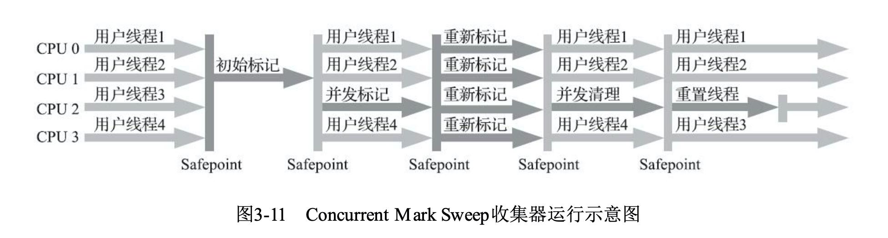
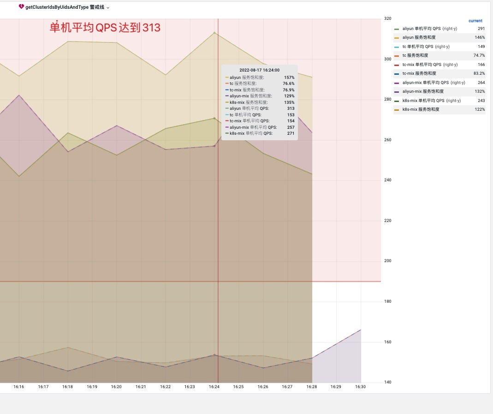
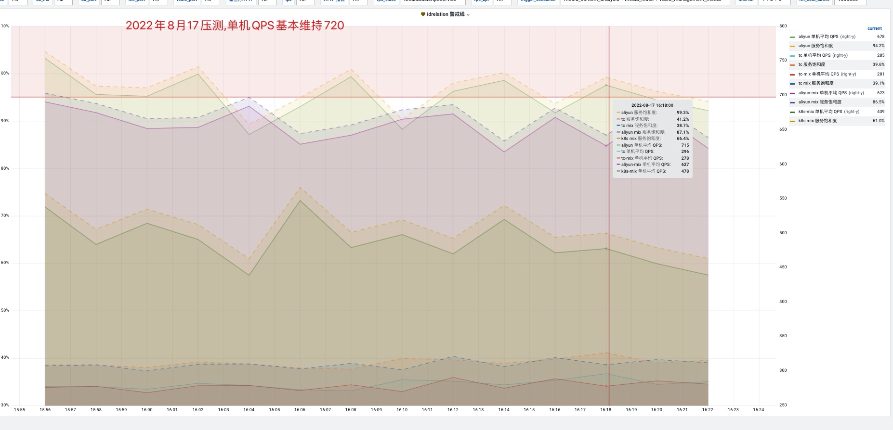
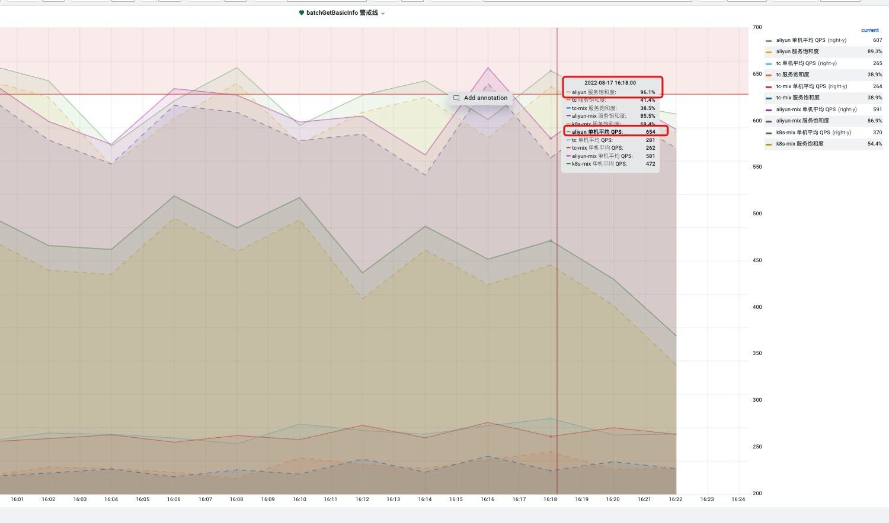
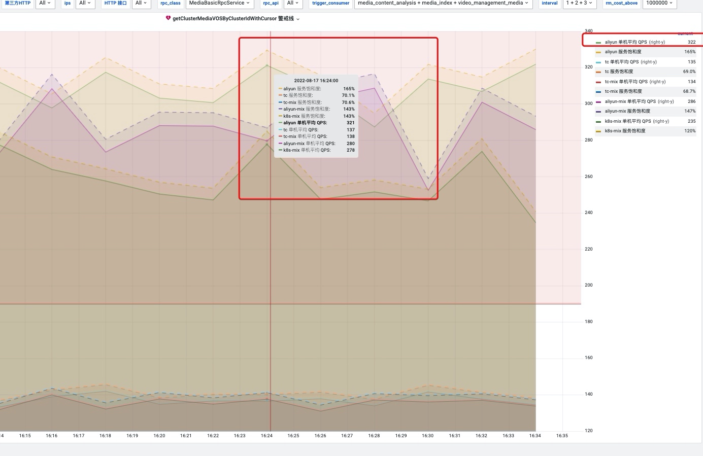
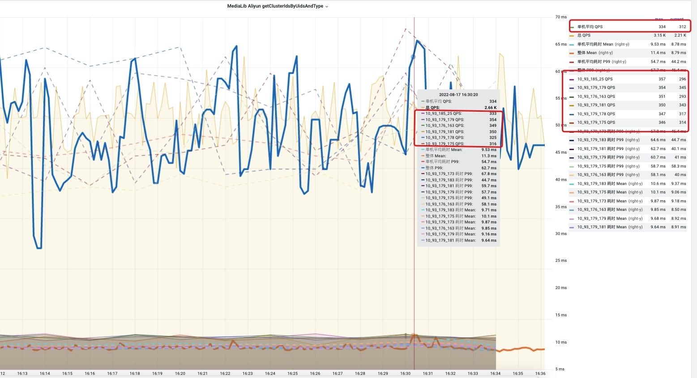

# 媒体库Java17压测方案
媒体库线上机器分配情况

```
{
    "openapi_medialib_web-aliyun": 8,
    "openapi_medialib_web-aliyun-mix": 13,
    "openapi_medialib_web-tc": 16,
    "openapi_medialib_web-tc-mix": 16
}
{
    "openapi_medialib_web-aliyun": "10.93.179.173,10.93.179.175,10.93.179.178,10.93.179.181,10.93.179.183,10.93.176.163,10.93.179.179,10.93.185.25",
    "openapi_medialib_web-aliyun-mix": "10.93.185.66,10.93.176.165,10.93.176.164,10.93.178.137,10.93.185.65,10.93.179.187,10.93.179.184,10.93.179.188,10.93.179.189,10.93.185.68,10.93.179.185,10.93.178.136,10.93.178.139",
    "openapi_medialib_web-tc": "10.185.10.156,10.185.10.155,10.185.10.150,10.185.10.153,10.182.11.159,10.185.10.109,10.182.11.158,10.182.11.161,10.182.11.156,10.182.11.163,10.185.10.151,10.185.10.152,10.182.11.157,10.182.11.160,10.182.11.162,10.185.10.154",
    "openapi_medialib_web-tc-mix": "10.185.15.148,10.185.9.240,10.185.9.201,10.185.8.191,10.185.9.228,10.185.10.200,10.182.7.171,10.182.5.63,10.185.8.162,10.182.6.122,10.182.6.168,10.185.8.187,10.182.7.166,10.182.5.108,10.185.8.23,10.185.8.163"
}
```
第五次压测:

10.93.179.183 8g noConc

```shell

grep 'GC Workers:' gc-2022-06-09_17*.log

tail -f gc-2022-06-09_17*.log | grep 'Critical: Allocation Stall'


tail -f gc-2022-06-09_17*.log | grep 'Memory: Allocation Rate'


tail -f gc-2022-06-09_17*.log | grep -E 'Phase: (Pause Mark Start|Pause Mark End|Pause Relocate Start)'


tail -f gc-2022-06-09_17*.log | grep 'gc,heap'


tail -f gc-2022-06-09_17*.log | grep 'gc,load'


```


依照目前已知的结论

Java 17  12G堆内存  -XX:ZCollectionInterval=5  运行正常

Java 17  16G堆内存  -XX:ZCollectionInterval=2  正常

实验一:

| Java版本 | 垃圾回收器 |堆内存| 关键参数| 部署IP | 机器配置
| ------ | ------ |------ |------ | ------ |------ |
| 17(已部署)  | ZGC | 16G |-XX:ZCollectionInterval=2 -XX:ConcGCThreads=2 | 10.93.179.178 | 16核 32G
| 17(已部署) | ZGC | 16G |-XX:ZCollectionInterval=2,去掉-XX:ConcGCThreads | 10.93.179.175 | 16核 32G
| 17(已部署) | ZGC | 16G |-XX:ZCollectionInterval=2,固定-XX:ConcGCThreads=10 | 10.93.179.181 | 16核 32G
| 17(已部署) | ZGC | 8G |-XX:ZCollectionInterval=2,去掉-XX:ConcGCThreads | 10.93.179.183 | 16核 32G
| 17(已部署) | ZGC | 8G |-XX:ZCollectionInterval=2,固定-XX:ConcGCThreads=10 | 10.93.176.163 | 16核 32G
| 8 | G1 | 8G | 线上对照组 三台机器 |

主要比较 在阿里云机器下,去掉ConcGCThreads 线程回收数对性能的影响

实验结论:


docker run -e "NAME_CONF=openapi_medialib_web-tc=/data1/weibo" -d --cap-add SYS_NICE --ulimit nofile=200000 --name medialib -v /data1/motan/logs:/data1/motan/logs -v /data1/medialib/logs/:/data1/weibo/logs/ -v /data1/medialib/gclogs/:/data1/weibo/gclogs/ -v /data1/openapi-config/:/data1/openapi-config/ -v /data1/breeze/socks/:/data1/breeze/socks/ --env=["NAME_CONF=openapi_medialib_web-tc=/data1/weibo"] -e "MALLOC_ARENA_MAX=16" --net="host" --expose=8080 registry.api.weibo.com/ci/medialib:dev-jdk17-8g-g1-1.0.2.566-snapshot /docker_init.sh

registry.api.weibo.com/ci/medialib:dev-jdk17-8g-g1-1.0.2.566-snapshot

docker run -e "NAME_CONF=openapi_medialib_web-aliyun=/data1/weibo" -d --cap-add SYS_NICE --ulimit nofile=200000 --name medialib -v /data1/motan/logs:/data1/motan/logs -v /data1/medialib/logs/:/data1/weibo/logs/ -v /data1/medialib/gclogs/:/data1/weibo/gclogs/ -v /data1/openapi-config/:/data1/openapi-config/ -v /data1/breeze/socks/:/data1/breeze/socks/ --env=["NAME_CONF=openapi_medialib_web-aliyun=/data1/weibo"] -e "MALLOC_ARENA_MAX=16" --net="host" --expose=8080 registry.api.weibo.com/ci/medialib:develop-1.0.2.569-snapshot /docker_init.sh

实验二:

| Java版本 | 垃圾回收器 |堆内存| 关键参数| 部署IP | 机器配置
| ------ | ------ |------ |------ | ------ |------ |
| 17 | ZGC | 12G |-XX:ZCollectionInterval=5 (=2的情况会崩掉) | 10.93.179.178 | 16核 32G
| 17 | ZGC | 12G |-XX:ZCollectionInterval=5 (=2的情况会崩掉) | 10.185.10.155 | 8核 16G
| 8 | G1 | 12G | 保持线上其余参数 | 10.93.179.181| 16核 32G
| 8 | G1 | 8G | 线上对照组 |

本次实验主要目的:

1. tc机器 配置较低 运行 java17 12G堆内存效果
2. 阿里云机器在同样堆内存下,使用ZGC和G1的性能差异

实验三:

| Java版本 | 垃圾回收器 |堆内存| 关键参数| 部署IP | 机器配置
| ------ | ------ |------ |------ | ------ |------ |
| 17 | ZGC | 12G |-XX:ZCollectionInterval=5,| 10.93.179.178 | 16核 32G
| 17 | ZGC | 12G |-XX:ZCollectionInterval=5,去掉-XX:ConcGCThreads(zgc自动调整回收线程数) | 10.93.179.175 | 16核 32G
| 17 | ZGC | 8G |-XX:ZCollectionInterval=5,去掉-XX:ConcGCThreads(zgc自动调整回收线程数) | 10.93.179.175 | 16核 32G
| 8 | G1 | 8G | 线上对照组 |

主要比较 同等堆内存下 ConcGCThreads 线程回收数对性能的影响

首先确定java17 8g 调整参数垃圾回收线程数量的情况下是否可以正常运行?

确定一个java17 8g的参数

确定一个java17 16g的参数
java17 8G先挂掉, 得出证据和结论
java8 8G 性能瓶颈达到,sla指标到达平时两倍, java17 16G是否正常的结论?
java17 16G多部署几台的平均性能

mix 13台机器停量(有问题全部200接量,当做备用)

java 8  8g 2台
java 8  16g 2台
java 17 8g (可以在调参数) 2台
java 17 16g 2台
java 17 16g 借10台

已知的结论
Java 17  12G堆内存  -XX:ZCollectionInterval=5  运行正常
Java 17  16G堆内存  -XX:ZCollectionInterval=2  正常

# 媒体库Java17日常部署运行


java 8   四种组合部署线上观察
8G    16G G1垃圾回收其他参数保持不变
java 17
8G (先部署一台)    16G (两台机器)


docker exec -t sh 503.sh

docker exec -t sh 200.sh


预期表现好的就是


|实验编号| 参数 |台数| mr | 部署镜像 | IP|
| ------| ------ |------ | ------ |------ |------ |
|1| `Java17 16G interval=2 noconc`|5台|https://git.intra.weibo.com/im/medialib/-/merge_requests/1616 | registry.api.weibo.com/ci/medialib:dev-wenbo17-runtime-jdk17-16g-noconc-1.0.2.564-snapshot | 10.93.185.21,10.93.179.182,10.93.179.160,10.93.185.62,10.93.178.138|
|2| `Java17 16G interval=2 conc=10`|5台|https://git.intra.weibo.com/im/medialib/-/merge_requests/1617 | registry.api.weibo.com/ci/medialib:dev-wenbo17-runtime-jdk17-16g-conc10-1.0.2.564-snapshot | 10.93.187.52,10.93.185.15,10.93.176.162,10.93.179.186,10.93.186.229|
|3| `Java17 8G interval=2 conc=10`|2台|https://git.intra.weibo.com/im/medialib/-/merge_requests/1615 | registry.api.weibo.com/ci/medialib:dev-wenbo17-runtime-jdk17-8g-conc10-1.0.2.564-snapshot |10.93.179.183,10.93.176.163|
|4| `Java17 12G interval=2 conc=10`|2台|https://git.intra.weibo.com/im/medialib/-/merge_requests/1618 | registry.api.weibo.com/ci/medialib:dev-wenbo17-runtime-jdk17-12g-interval2-conc10-1.0.2.564-snapshot | 10.93.179.178,10.93.179.181|
|5| `Java8 16G `|2台| https://git.intra.weibo.com/im/medialib/-/merge_requests/1619 | registry.api.weibo.com/ci/medialib:dev-runtime-jdk8-16g-1.0.2.564-snapshot | 10.93.179.173,10.93.179.175|
|6| `Java8 8G `|2台|线上版本|registry.api.weibo.com/ci/medialib:1.0.2.563 | 10.93.179.179,10.93.185.25|


aliyun-mix 13台  全部503

aliyun  8台
  2台 17 8g conc=10
  2台 17 12g conc=10
  2台 8 16g
  2台 8 8g
  
aliyun ext 2台
   1台 17 16g conc=10
   1台 17 16g noconc
   
接量共计  10台

503 IP:

10.93.185.21,10.93.179.182,10.93.179.160,10.93.185.62

10.93.187.52,10.93.185.15,10.93.176.162,10.93.179.186


aliyun  6台
  1台 17 8g conc=10
  1台 17 12g conc=10
  2台 8 16g
  2台 8 8g
  
aliyun ext 2台
   1台 17 16g conc=10
   1台 17 16g noconc
   
接量共计  8台

503 IP: 10台

10.93.185.21,10.93.179.182,10.93.179.160,10.93.185.62

10.93.187.52,10.93.185.15,10.93.176.162,10.93.179.186
10.93.179.178,10.93.179.183


帮忙200
10.93.179.178,10.93.179.183

将池子
openapi_medialib_web-aliyun-mix
全部200


第一轮两个 Java17 8G Conc=10 日志观察

10.93.179.183 8g Conc=10

```shell

grep 'GC Workers:' gc-2022-06-16_15-00-07.log


tail -f gc-2022-06-16_*.log | grep 'Critical: Allocation Stall'


tail -f gc-2022-06-16_15-00-07.log | grep 'Memory: Out Of Memory'


tail -f gc-2022-06-16_15-00-07.log | grep 'Memory: Allocation Rate'


tail -f gc-2022-06-16_15-00-07.log | grep -E 'Phase: (Pause Mark Start|Pause Mark End|Pause Relocate Start)'


tail -f gc-2022-06-16_15-00-07.log | grep 'gc,heap'


tail -f gc-2022-06-16_15-00-07.log | grep 'gc,load'


```


10.93.176.163 8g Conc=10

```shell


grep 'GC Workers:' gc-2022-06-09_17-22-02.log


tail -f gc-2022-06-09_17-22-02.log | grep 'Critical: Allocation Stall'


tail -f gc-2022-06-09_17-22-02.log | grep 'Memory: Out Of Memory'


tail -f gc-2022-06-09_17-22-02.log | grep 'Memory: Allocation Rate'


tail -f gc-2022-06-09_17-22-02.log | grep -E 'Phase: (Pause Mark Start|Pause Mark End|Pause Relocate Start)'


tail -f gc-2022-06-09_17-22-02.log | grep 'gc,heap'


tail -f gc-2022-06-09_17-22-02.log | grep 'gc,load'


```


183日常运行crash日志:

gc日志可以肯定ICBufferFull关系很大

```
[INFO] 20220622 17:32:49.530 [catalina-exec-591] access - (from 10.182.6.76, cost=13 ms), GET /2/media/media.json status=200, header={authorization=[TAuth2 token="OXQNTOTQWUTPXNXON%3DOUP%3DOPUYNYNYOXOTSTNTNTROXNXOXc0f%407%2Bg7h%2B",param="uid%3D5186027114",sign="7p%2FgS%2BnsmcD0U5yxH3eadvkO5Yw%3D"]}, params={media_id=[4783212787073107], source=[3061639762]}, body={}, response (len=20050) {"media":{"media_id":"4783212787073107","cover":"[]","create_type":0,"client_ip":"27.188.175.34","client_type":2,"author_uid":7602741247,"client_source":"2637646381","meta_extension":"{\"input_context\":{\"verify_type\":\"yellow\",\"uid\":7602741247,\"customized\":{\"upload_type\":\"upload\",\"is_contribution\":\"1\",\"video\":\"normal\",\"source\":\"2637646381\",\"screenshot\":\"1\",\"object_id\":\"1034:4783212787073107\",\"url\":\"http://f.video.weibocdn.com/o0/sEILoI9Mlx07X30pWqEE01041200bONu 32dba85d-d48f-4613-9cc4-85820559eb00
```


-XX:+UseCountedLoopSafepoints -XX:+SafepointTimeout -XX:SafepointTimeoutDelay=1000

[INFO] 20220627 17:44:48.133 [pool-479-thread-399] accessLog - referer|video-union-rpc|tc-video-union-rpc|10.182.14.41|com.weibo.api.videoaggregation.rpcclient.UnionClusterRpcService|getItemCountsByClusterIds|java.util.List|10.93.47.90|video-union-rpc|tc-video-union-rpc|true|1736780637877230677|558 b090cbaa-54a2-43d8-8a9f-60fc9de16cb1

17:44:47.574  story 发出

中间gap=487ms

union 17:44:48.062  开始处理

```
[INFO] 20220627 17:44:48.066 [NettyServer-10.93.47.90:8004-3-thread-318] accessLog - referer|medialib-rpc|aliyun-medialib-rpc|10.93.47.90|com.weibo.media.service.MediaClusterRpcService|getMediaCountsByClusterIds|com.weibo.media.bean.context.cluster.GetMediaCountsByClusterIdsContext|10.93.185.65|medialib-rpc|aliyun-medialib-rpc|true|3357342520917300762|3 b090cbaa-54a2-43d8-8a9f-60fc9de16cb1
[INFO] 20220627 17:44:48.066 [NettyServer-10.93.47.90:8004-3-thread-318] accessLog - service|video-union-rpc|aliyun-video-union-rpc|10.93.47.90|com.weibo.api.videoaggregation.rpcclient.UnionClusterRpcService|getItemCountsByClusterIds|java.util.List|[[4658915854712845]]|10.182.14.41|video-union-rpc|tc-video-union-rpc|true|{4658915854712845=129}||4 b090cbaa-54a2-43d8-8a9f-60fc9de16cb1

```


cms (concurrenc mark swap)垃圾回收器分为四个阶段

- 初始标记 stop the world
- 并发标记 并发执行
- 再标记 stop the world
- 并发清除




缺点:

1. 并发清楚,占用cpu资源明显, 影响吞吐量
2. 浮动垃圾,再次full gc
3. 标记-清除算法,内存碎片产生


1. 503 五台
10.93.179.189,
10.93.185.68,
10.93.179.185,
10.93.178.136,
10.93.178.139

机器剩余情况:

- aliyun:8台
- mix-aliyun:8台
- mix-aliyun 503：5台

### 3.  16:28 503掉五台

10.93.185.65,
10.93.179.187,
10.93.179.184,
10.93.179.188,
10.93.176.164,


机器剩余情况
- aliyun: 8台
- mix-aliyun: 3台
- mix-aliyun 503：10台

### 4.  

10.93.178.137

机器剩余情况:

- aliyun: 8台
- mix-aliyun: 2台
- mix-aliyun 503：11台


    "openapi_medialib_web-aliyun-mix": "10.93.185.66,10.93.176.165,10.93.176.164,10.93.178.137,10.93.185.65,10.93.179.187,10.93.179.184,10.93.179.188,10.93.179.189,10.93.185.68,10.93.179.185,10.93.178.136,10.93.178.139",
    











