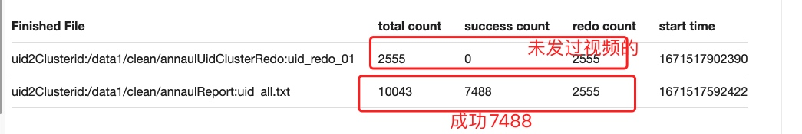
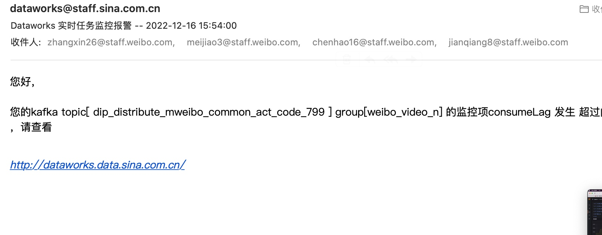

# # work-plan-2022-12-12

### 视频对象下行图片http强转https(建强)
> 浏览器升级安全策略,图床防刷策略失效 导致图片加载失败
* 对象库下行: 打了新包,等待放量观察
* publish修改(佩文) -已上线,修改开关即可
* exchange修改(建强) - 已上线
* 转码截图配置- 文博 - 待上线

### log-processor 堆积梳理(建强)
> kafka分区 120个. 记录已读QPS单机6k开始堆积(原压测峰值为8.5K)
> 目前使用自动扩缩容(延迟>30s 扩5台 延迟想<2s 缩容)

1. 799错误日志问题, 和客户端同学反馈799日志中
2. 修复profile日志错误数据问题, 下调探测报警
3. 排查jstack查看热点方法,后续待定

### output中处理snapshot防盗链处理上浮(建强)

* 对output中图片做防盗链处理在底层, 导致目前snapshot在替换视频的逻辑中会因为防盗链之后字符过长写入失败
* 和曾哥确认只有审核依赖, 将逻辑上浮到审核接口处
* 排期: 下周五 12月16号上线

###  magma后台替换output bug修复(建强)
* 替换调用接口query过长,直接修改为使用媒体库replace接口(不替换input的话,会导致热门转码发起视频未替换)
* 新问题: 若旧视频发起过热门转码, 那么新mediaId依然会发起热门转码, 此时下载文件使用的是input中的`filemetaId`去作为转码的原始文件,所以必须重新修改input中才会生效
* replace v2版本逻辑确认
* 排期: 待定 修复完snapshot相关bug后再跟进

###  mca-video-ai 去AB依赖(建强) - 完成 待上线
 * video-ai去AB依赖(到期报警邮件), 依靠Dconfs做函数分流
 * 排期: 延后(时间太久,重新梳理代码中)

### 佩奇接入后台

试用佩奇后天,提供若干修改建议

###  2022创作者年报需求
1. 根据uid获取clusterId  

    总共数据条数 10043 存在集合id的 7488条
3. 根据uid,clusterId 分页获取视频数据,里边都是mid
4. 根据mid 获取转评赞+播放数+是否删除+是否公开
5. 

https://m.weibo.cn/3831714542/4844450960377480
-------上不了台面的

### log-processor 和mca巡检
* log-processor https://git.intra.weibo.com/im/form/-/issues/7422
* mca巡检  https://git.intra.weibo.com/im/form/-/issues/7448
* medialib巡检  

###  媒体库高可用核心资源梳理  
* [文档地址](https://wiki.api.weibo.com/zh/weibo_rd/weibo_rd_video/%E8%A7%86%E9%A2%91%E4%B8%AD%E5%8F%B0/wiki/%E4%B8%AD%E5%8F%B0%E6%A0%B8%E5%BF%83%E8%B5%84%E6%BA%90%E6%A2%B3%E7%90%86)
* 进展: 媒体库的redis资源写到文档中

这个监控看看加上秦老板

1. 哪些有锁或者其他耗时操作 CPU利用率为什么上不去了??,  单核卡到网卡终端
2. CPU频繁耗用在哪里?

1. mca三节保障梳理一遍
2. medialib三节保障梳理一遍,主要看下降级开关是啥样的
3. log-procesoor 开关试下
4. 佩奇配置一个试下

wtool switcher show harmonia.redis.lock.open --ips $(kubectl get pods -n wb-plat-video -o wide|grep medialib |awk '{print $6}' |tr "\r\n" ",") --port 880

docker run  -p 7980:7979 -v /data0/data1/burui_workspace/monitor/json_path/config.yml:/config.yml --name json_exporter_pool registry.api.weibo.com/shixi_burui/json_path  --config.file=/config.yml

[ERROR] 20221222 23:11:16.585 [pool-170-thread-1] AnnualReportItemAllCountNum - AnnualReportItemAllCountNum fail get future this list exception
java.lang.InterruptedException
        at java.util.concurrent.FutureTask.awaitDone(FutureTask.java:404)
        at java.util.concurrent.FutureTask.get(FutureTask.java:204)
        at com.weibo.media.controller.wash.AnnualReportItemAllCountNum.lambda$handler$4(AnnualReportItemAllCountNum.java:68)
        at java.util.HashMap.forEach(HashMap.java:1289)
        at com.weibo.media.controller.wash.AnnualReportItemAllCountNum.handler(AnnualReportItemAllCountNum.java:66)
        at com.weibo.cleaner.core.processor.TaskProcessor.doTask(TaskProcessor.java:73)
        at com.weibo.cleaner.core.processor.TaskProcessor.startTask(TaskProcessor.java:61)
        at com.weibo.cleaner.mgr.dispatcher.TaskDispatcher.lambda$null$5(TaskDispatcher.java:176)
        at java.util.concurrent.Executors$RunnableAdapter.call(Executors.java:511)
        at java.util.concurrent.FutureTask.run(FutureTask.java:266)
        at java.util.concurrent.ThreadPoolExecutor.runWorker(ThreadPoolExecutor.java:1149)
        at java.util.concurrent.ThreadPoolExecutor$Worker.run(ThreadPoolExecutor.java:624)
        at java.lang.Thread.run(Thread.java:748)