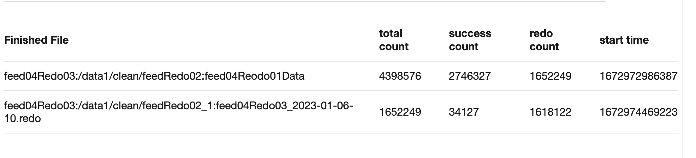
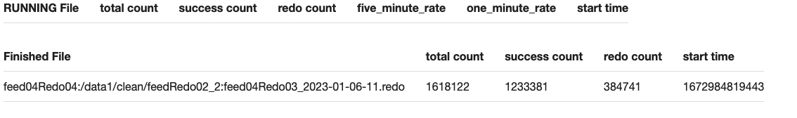

# # work-plan-2023-01-03

### 视频对象下行图片http强转https(建强)
> 浏览器升级安全策略,图床防刷策略失效 导致图片加载失败
* 对象库下行: 打了新包,等待放量观察
* publish修改(佩文) -已上线,修改开关即可
* exchange修改(建强) - 已上线
* 转码截图配置- 文博 - 待上线

### output中处理snapshot防盗链处理上浮(建强)

* 对output中图片做防盗链处理在底层, 导致目前snapshot在替换视频的逻辑中会因为防盗链之后字符过长写入失败
* 和曾哥确认只有审核依赖, 将逻辑上浮到审核接口处
* 排期: 下周五 12月16号上线

###  magma后台替换output bug修复(建强)
* 替换调用接口query过长,直接修改为使用媒体库replace接口(不替换input的话,会导致热门转码发起视频未替换)
* 新问题: 若旧视频发起过热门转码, 那么新mediaId依然会发起热门转码, 此时下载文件使用的是input中的`filemetaId`去作为转码的原始文件,所以必须重新修改input中才会生效
* replace v2版本逻辑确认
* 排期: 待定 修复完snapshot相关bug后再跟进

###  mca-video-ai 去AB依赖(建强) - 完成 待上线
 * video-ai去AB依赖(到期报警邮件), 依靠Dconfs做函数分流
 * 排期: 延后(时间太久,重新梳理代码中)

### 佩奇接入后台

试用佩奇后天,提供若干修改建议

### 2022创作者年报需求
- 129w用户预计91w用户从未发过视频或22年没发视频
- 视频总数6千万, 初版数据已出(先交付业务方开发中)
- check数据过程中发现有未取到mediaId+播放数的数据, 162w数据重跑两次都失败
    1. 视频编辑过,没视频了
    2. feed未返回object数组
    3. 非1034的视频,直播等
    4. 这部分数据可以尝试从媒体库取播放数, 不从feed接口返回

    
    

feed04_2023-01-06-00.result

feed04Redo03_2023-01-06-11.result  这两个跑的结果可用

### 素材中心统计数据
> 背景: 素材中心年度数据统计

- NBA总量: 27059  Q4总量 : 7388
- 中超总量: 307 Q4总量: 125

### originNima洗数据(完成)
> 元旦降级originNima未恢复,导致推荐一波数据无画质
1. 共计32w数据, 反馈当天晚上已重新完成
2. 统计32w数据中有67条失败,已确认无需处理

### 媒体库核心接口资源监控梳理

1. mc资源探测
2. 核心接口突增突降

### jstack分析性能问题
> 本周无进展
> 背景: 尝试使用小工具分析线程or线程池链路上性能瓶颈在哪

1. 线程依赖关系可以依赖trace(前期可以先人工输入)
2. 对输入的线程or线程池依赖链路的忙闲程度做统计

### log-processor 和mca巡检
* log-processor https://git.intra.weibo.com/im/form/-/issues/7422
* mca巡检  https://git.intra.weibo.com/im/form/-/issues/7448
* medialib巡检  

###  媒体库高可用核心资源梳理  
* [文档地址](https://wiki.api.weibo.com/zh/weibo_rd/weibo_rd_video/%E8%A7%86%E9%A2%91%E4%B8%AD%E5%8F%B0/wiki/%E4%B8%AD%E5%8F%B0%E6%A0%B8%E5%BF%83%E8%B5%84%E6%BA%90%E6%A2%B3%E7%90%86)
* 进展: 媒体库的redis资源写到文档中

