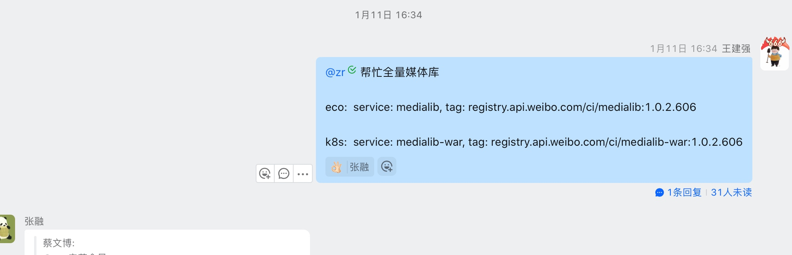
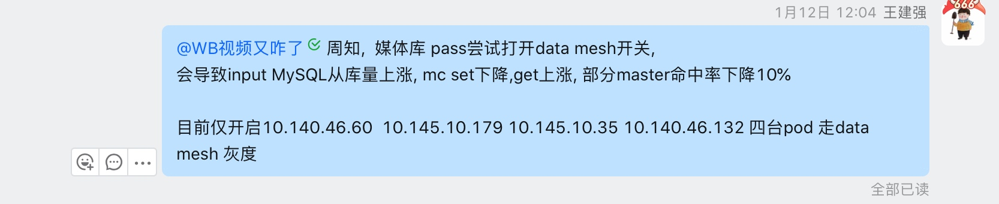
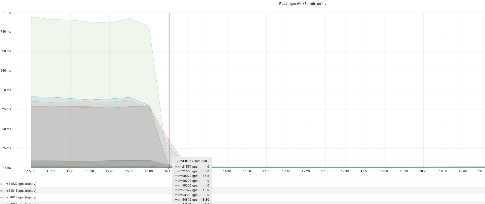

## work-plan-2023-01-31

### 媒体库核心链路数据流转
1. 核心发布链路 medialib exchange作为切入点

### 媒体库 三可用区
> 目前是双可用区,

1. medialib前端机挪过去
2. 上行资源单机放, 下行从库隔离机房
3. 增加上行高可用方案
4. [媒体库核心资源](https://wiki.api.weibo.com/zh/weibo_rd/weibo_rd_video/%E8%A7%86%E9%A2%91%E4%B8%AD%E5%8F%B0/wiki/%E4%B8%AD%E5%8F%B0%E6%A0%B8%E5%BF%83%E8%B5%84%E6%BA%90%E6%A2%B3%E7%90%86)

### 用户发布视频未入视频签问题排查
> 问题总结 - [问题总结wiki](https://wiki.api.weibo.com/zh/weibo_rd/weibo_rd_video/%E6%95%85%E9%9A%9C%E6%80%BB%E7%BB%93/%E5%AA%92%E4%BD%93%E5%BA%93trigger%E8%A2%AB%E6%89%93%E6%8C%82%E7%94%A8%E6%88%B7%E8%A7%86%E9%A2%91%E6%9C%AA%E5%85%A5%E8%A7%86%E9%A2%91%E7%AD%BE%E9%97%AE%E9%A2%98%E6%80%BB%E7%BB%93)

### 佩奇接入后台
1. mc cn1 cn2配置需要修改为default
2. 在预览环境启动,查看并比对各个bean属性

### 媒体库MySQL慢导致的slow
背景: MySQL慢查询导致接口异常量增高,进而有报警
切换MySQL数据库连接池

1. 抓包确认是否是MySQL server端慢了,抓包分析下
    1. 安装tcpdump,开一台机器抓一个端口的数据
    2. 分析某次链接是否正常返回? 链接存活时间怎么看?
2. 尝试分析下c3p0连接池代码? 看下能找到不?
3. 数据库连接池选型? 
4. spring boot 默认连接池 Hikari 配置一个端口,怎么只改一个?

### video-ai 分类模型kafka消费下线 MCA
- 交接内容要梳理下
    - ASR要拉上丰腾一起
    - 排查问题也要一起
- system-video-recom-video-quality-output 未在使用
    - 机器学习分类数据 mca将mediaId写入redis,k8s定时任务地址[address](http://video.admin.intra.weibo.com/k8s/#!/cronjob/cronjob/mca-qascore-waic?namespace=cronjob)
- system-videorecom-video-classify-output 正常在消费写入多维库,目前无出口,下线时间待确定
union接口category吐出的数据是 diversity库中的分类信息

- videoTextAnalysis 这个topic的数据生成方式与videoFeatureAnalysis一样吗？

### jstack分析性能问题
> 本周无进展
> 背景: 尝试使用小工具分析线程or线程池链路上性能瓶颈在哪
1. 现成的状态有 `start` `runnable` `waiting` `time waiting` `block` `终止`
2. 分析线上的某个线程池的状态
3. 列一个分析计划, 现成的依赖关系, 现成的状态,如何用统计的结论得到一个链路上繁忙与否的的信息?

### 下线trans AB实验使用的kafka
计划时间: 已完成

https://git.intra.weibo.com/im/video-log-processor/-/merge_requests/196

### 视频对象下行图片http强转https(建强)
> publish 开关已切 验证通过

### output中处理snapshot防盗链处理上浮(建强)

* 对output中图片做防盗链处理在底层, 导致目前snapshot在替换视频的逻辑中会因为防盗链之后字符过长写入失败
* 和曾哥确认只有审核依赖, 将逻辑上浮到审核接口处
* 排期: 下周五 12月16号上线

###  magma后台替换output bug修复(建强)
* 替换调用接口query过长,直接修改为使用媒体库replace接口(不替换input的话,会导致热门转码发起视频未替换)
* 新问题: 若旧视频发起过热门转码, 那么新mediaId依然会发起热门转码, 此时下载文件使用的是input中的`filemetaId`去作为转码的原始文件,所以必须重新修改input中才会生效
* replace v2版本逻辑确认
* 排期: 待定 修复完snapshot相关bug后再跟进

### log-processor 和mca巡检
* log-processor https://git.intra.weibo.com/im/form/-/issues/7422
* mca巡检  https://git.intra.weibo.com/im/form/-/issues/7448
* medialib巡检  

echo "off resource redis.mesh.count_playlist_items.allMethod.switcher" | nc "10.185.10.156" "880"

echo "off resource redis.mesh.media_input_output.allMethod.switcher" | nc "10.185.10.156" "880"

echo "off resource redis.mesh.medialib_cluster_id_name_parent_child_master.allMethod.switcher" | nc "10.185.10.156" "880"

echo "off resource redis.mesh.medialib_cluster_id_name_parent_child.allMethod.switcher" | nc "10.185.10.156" "880"

echo "off resource redis.mesh.medialib_id_mapping.allMethod.switcher" | nc "10.185.10.156" "880"

1月11号上线后观察redis监控是有量的,data mesh开关关闭

1月12号 在pass上打开部分机器开关  下午开始没监控的

