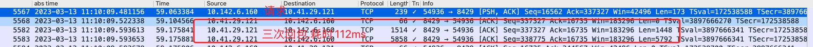

# RPC 异常问题排查

1. 联系DBA


[INFO] 20230315 17:00:11.014 [scheduler-10] accessLog - referer|medialib-rpc|bx-medialib-rpc|172.16.138.133|com.weibo.media.service.MediaService|setInputContext|java.util.Map%2Cjava.lang.String|10.140.46.172|medialib-rpc|bx-medialib-rpc|false|1155f874d81b70|623|0|1001|1001 2a603941-e62d-42ec-8e4f-c047a35c8e76
[


[INFO] 20230315 17:00:12.292 [NettyServer-10.140.46.172:8004-7-thread-62] accessLog - service|medialib-rpc|bx-medialib-rpc|10.140.46.172|com.weibo.media.service.MediaService|setInputContext|java.util.Map%2Cjava.lang.String|[{media_id=4879600162111504, source=1234556789, video_type=normal, biz_type=detect_test}, 4879600162111504]|172.16.138.133|medialib-rpc|bx-medialib-rpc|true|true|1155f874d81b70|146 -463478182596557903


nohup tcpdump -i eth0 'port 8429'  -G 60  -w yan_%Y_%m%d_%H%M_%S.pcap -Z root &


- 最新报警
[WARN] 20230315 15:52:05.039 [NettyServer-10.140.46.177:8004-7-thread-131] warn - Http request exceed timeout. cost:5024, url:http://api.admin.weibo.com/kwp/checkbylib?lib=124580 r=1481229785580140199 975452368422257724

[INFO] 20230315 15:00:01.006 [scheduler-28] accessLog - referer|medialib-rpc|bx-medialib-rpc|172.16.138.133|com.weibo.media.service.MediaService|initMedia|com.weibo.media.bean.context.InitContext|10.142.13.10|medialib-rpc|bx-medialib-rpc|false|1155f11f581753|683|0|1002|1002 bc3fd0d4-0543-4ecd-9ac2-a09f990156c9
[

[INFO] 20230315 15:00:01.754 [NettyServer-10.142.13.10:8004-7-thread-26] accessLog - service|medialib-rpc|bx-medialib-rpc|10.142.13.10|com.weibo.media.service.MediaService|initMedia|com.weibo.media.bean.context.InitContext|[InitContext(super=BaseMetaContext(cover=null, createType=UNKNOWN, clientIp=172.16.138.133, clientType=OTHER, authorUid=2706683357, clientSource=null, extension=null, state=PUBLISH, origin={"valar_morghulis":true}), mediaId=null)]|172.16.138.133|medialib-rpc|bx-medialib-rpc|true|4879569967317111|1155f11f581753|53 -8258011122457819577


[WARN] 20230313 19:10:09.593 [playlist_item_read_db_base_executor-255] CommonJdbcTemplate - mysql execute slow,jdbcUrl:jdbc:mysql://s8429i.hebe.grid.sina.com.cn:8429?useUnicode=true&characterEncoding=UTF-8&rewriteBatchedStatements=true&cachePrepStmts=true&autoReconnect=true&statementInterceptors=com.weibo.api.harmonia.trace.mysql.MysqlTraceInterceptor&useSSL=false,sql:select item_id from cluster_item_3b.cluster_item_3bb   force index(`playlist_id`) where playlist_id=?  and item_type != 6  ORDER BY item_id asc LIMIT 501,args:[4625520185507930],cost:112,slowThreshold:100 3bbeda19-37dd-4cf4-9335-8cc03fe75aa8




[WARN] 20230313 19:11:00.498 [NettyServer-10.142.6.160:8004-7-thread-29] CommonJdbcTemplate - mysql execute slow,jdbcUrl:jdbc:mysql://s8429i.hebe.grid.sina.com.cn:8429?useUnicode=true&characterEncoding=UTF-8&rewriteBatchedStatements=true&cachePrepStmts=true&autoReconnect=true&statementInterceptors=com.weibo.api.harmonia.trace.mysql.MysqlTraceInterceptor&useSSL=false,sql:select * from cluster_item_3a.cluster_item_3a7 where playlist_id=?  and item_type != 6  order by item_id desc limit 2000,args:[4525222427295852],cost:129,slowThreshold:100 51d0c154-887c-49fe-b327-e1ff7fa8ff49


```
 117 mysql://s9936i.mars.grid.sina.com.cn:9936?useUnicode=true&characterEncoding
 124 mysql://s9937i.mars.grid.sina.com.cn:9937?useUnicode=true&characterEncoding
 124 mysql://s9938i.mars.grid.sina.com.cn:9938?useUnicode=true&characterEncoding
 129 mysql://m9810i.eos.grid.sina.com.cn:9810?useUnicode=true&characterEncoding
 133 mysql://s9939i.mars.grid.sina.com.cn:9939?useUnicode=true&characterEncoding
 137 mysql://m10051i.eos.grid.sina.com.cn:10051?useUnicode=true&characterEncoding
 141 mysql://s9935i.mars.grid.sina.com.cn:9935?useUnicode=true&characterEncoding
 147 mysql://m8891i.eos.grid.sina.com.cn:8891?useUnicode=true&characterEncoding
 152 mysql://m10045i.eos.grid.sina.com.cn:10045?useUnicode=true&characterEncoding
 155 mysql://m10052i.eos.grid.sina.com.cn:10052?useUnicode=true&characterEncoding
 156 mysql://m10041i.eos.grid.sina.com.cn:10041?useUnicode=true&characterEncoding
 156 mysql://s9940i.mars.grid.sina.com.cn:9940?useUnicode=true&characterEncoding
 161 mysql://m10046i.eos.grid.sina.com.cn:10046?useUnicode=true&characterEncoding
 165 mysql://m10038i.eos.grid.sina.com.cn:10038?useUnicode=true&characterEncoding
 166 mysql://m10049i.eos.grid.sina.com.cn:10049?useUnicode=true&characterEncoding
 171 mysql://m10042i.eos.grid.sina.com.cn:10042?useUnicode=true&characterEncoding
 172 mysql://m10037i.eos.grid.sina.com.cn:10037?useUnicode=true&characterEncoding
 176 mysql://m10044i.eos.grid.sina.com.cn:10044?useUnicode=true&characterEncoding
 177 mysql://m10039i.eos.grid.sina.com.cn:10039?useUnicode=true&characterEncoding
 180 mysql://m10050i.eos.grid.sina.com.cn:10050?useUnicode=true&characterEncoding
 186 mysql://m10040i.eos.grid.sina.com.cn:10040?useUnicode=true&characterEncoding
 188 mysql://m10043i.eos.grid.sina.com.cn:10043?useUnicode=true&characterEncoding
 191 mysql://s8032i.mars.grid.sina.com.cn:8032?useUnicode=true&characterEncoding
 215 mysql://m8892i.eos.grid.sina.com.cn:8892?useUnicode=true&characterEncoding
 215 mysql://s8032i.eos.grid.sina.com.cn:8032?useUnicode=true&characterEncoding
 221 mysql://s8031i.eos.grid.sina.com.cn:8031?useUnicode=true&characterEncoding
 239 mysql://m10047i.eos.grid.sina.com.cn:10047?useUnicode=true&characterEncoding
 264 mysql://m10048i.eos.grid.sina.com.cn:10048?useUnicode=true&characterEncoding
 295 mysql://s9942i.mars.grid.sina.com.cn:9942?useUnicode=true&characterEncoding
 336 mysql://s8031i.mars.grid.sina.com.cn:8031?useUnicode=true&characterEncoding
 480 mysql://s9810i.eos.grid.sina.com.cn:9810?useUnicode=true&characterEncoding
 884 mysql://s9941i.mars.grid.sina.com.cn:9941?useUnicode=true&characterEncoding
 986 mysql://s8424i.hebe.grid.sina.com.cn:8424?useUnicode=true&characterEncoding
1016 mysql://s8428i.hebe.grid.sina.com.cn:8428?useUnicode=true&characterEncoding
1241 mysql://s8422i.hebe.grid.sina.com.cn:8422?useUnicode=true&characterEncoding
1344 mysql://s8426i.hebe.grid.sina.com.cn:8426?useUnicode=true&characterEncoding
1425 mysql://s8423i.hebe.grid.sina.com.cn:8423?useUnicode=true&characterEncoding
1515 mysql://s8278i.eos.grid.sina.com.cn:8278?useUnicode=true&characterEncoding
1758 mysql://s8425i.hebe.grid.sina.com.cn:8425?useUnicode=true&characterEncoding
2165 mysql://s8427i.hebe.grid.sina.com.cn:8427?useUnicode=true&characterEncoding
2245 mysql://s8429i.hebe.grid.sina.com.cn:8429?useUnicode=true&characterEncoding
```
```
11688 clusteritem
 461 itemcluster
  46 mediaasr
  10 mediaconfig
 333 mediainput
  95 mediameta
 696 mediaoutput
   3 videowall.video
 ```  
 
- 8422主库超时

```
[WARN] 20230313 15:10:04.115 [NettyServer-10.4.136.95:8004-7-thread-24] CommonJdbcTemplate - mysql execute slow,jdbcUrl:jdbc:mysql://m8422i.eos.grid.sina.com.cn:8422?useUnicode=true&characterEncoding=UTF-8&rewriteBatchedStatements=true&cachePrepStmts=true&autoReconnect=true&statementInterceptors=com.weibo.api.harmonia.trace.mysql.MysqlTraceInterceptor&useSSL=false,sql:INSERT INTO item_cluster_00.item_cluster_000 (update_time,item_id,playlist_id,item_type,playlist_type) VALUES (?, ?, ?, ?, ?) ON DUPLICATE KEY UPDATE update_time=VALUES(update_time),item_type=VALUES(item_type),playlist_type=VALUES(playlist_type),args:[2023-03-13T15:10:00.169+0800, 4370080118796524, 4878847699779714, 1, 2],cost:3946,slowThreshold:100 1740423434914186660de
``` 
 
- 8424主库超时

```
[WARN] 20230313 00:04:02.326 [NettyServer-10.140.46.160:8004-7-thread-76] CommonJdbcTemplate - mysql execute slow,jdbcUrl:jdbc:mysql://m8424i.eos.grid.sina.com.cn:8424?useUnicode=true&characterEncoding=UTF-8&rewriteBatchedStatements=true&cachePrepStmts=true&autoReconnect=true&statementInterceptors=com.weibo.api.harmonia.trace.mysql.MysqlTraceInterceptor&useSSL=false,sql:INSERT INTO cluster_item_16.cluster_item_163 (update_time,item_id,playlist_id,item_type) VALUES (?, ?, ?, ?) ON DUPLICATE KEY UPDATE update_time=VALUES(update_time),item_type=VALUES(item_type),args:[2023-03-13T00:04:00.123+0800, 4878619697414261, 4878619697414318, 3],cost:2191,slowThreshold:100 -2217391195894496051
``` 
 
- 9939超时

```

[WARN] 20230313 00:11:04.760 [NettyServer-10.142.10.81:8004-7-thread-229] CommonJdbcTemplate - mysql execute slow,jdbcUrl:jdbc:mysql://m9939i.eos.grid.sina.com.cn:9939?useUnicode=true&characterEncoding=UTF-8&rewriteBatchedStatements=true&cachePrepStmts=true&autoReconnect=true&statementInterceptors=com.weibo.api.harmonia.trace.mysql.MysqlTraceInterceptor&useSSL=false,sql:DELETE FROM user_cluster_10.user_cluster_10c WHERE playlist_id = ? AND `uid` = ? ,args:[4878621459021935, 5058700662],cost:4329,slowThreshold:100 -3433314394391621972
``` 

- 获取链接超时  5000ms了

```
[WARN] 20230313 06:55:25.088 [NettyServer-10.140.46.177:8004-7-thread-194] CommonJdbcTemplate - mysql execute error,jdbcUrl:jdbc:mysql://m10049i.eos.grid.sina.com.cn:10049?useUnicode=true&characterEncoding=UTF-8&cachePrepStmts=true&autoReconnect=true&statementInterceptors=com.weibo.api.harmonia.trace.mysql.MysqlTraceInterceptor&useSSL=false,sql:select * from  media_output_c.media_output_202303 where media_id = ? ,args:[4878723128950864],cost:15001 8769863907617754499

The last packet sent successfully to the server was 0 milliseconds ago. The driver has not received any packets from the server. 8769863907617754499
```


- 查询主库超时

```
error_message: com.weibo.api.motan.rpc.DefaultResponseFuture request timeout: serverPort=10.140.46.195:8004 requestId=1759956560784725571 interface=com.weibo.media.service.MediaService method=addFileMetaList(com.weibo.media.bean.context.AddFileMetaContext) cost=1000, status: 503, error_code: 10003,r=null


[WARN] 20230310 13:16:12.002 [NettyServer-10.140.46.195:8004-7-thread-116] CommonJdbcTemplate - mysql execute slow,jdbcUrl:jdbc:mysql://m10047i.eos.grid.sina.com.cn:10047?useUnicode=true&characterEncoding=UTF-8&cachePrepStmts=true&autoReconnect=true&statementInterceptors=com.weibo.api.harmonia.trace.mysql.MysqlTraceInterceptor&useSSL=false,sql:select * from  media_output_a.media_output_202303 where media_id = ? ,args:[4877731847143511],cost:1951,slowThreshold:100 7261673739911446742
```


- 看下为啥

```log
删除视频集失败！unionClusterRpcService.deleteClusters failed,requestId:115450a358588e,error:error_message: biz exception cause is null. origin error msg : error_message: provider error, org err:error_message: com.weibo.api.motan.rpc.DefaultResponseFuture request timeout: serverPort=10.145.11.83:8004 requestId=1759968566978031147 interface=com.weibo.media.service.MediaClusterRpcService method=createOrUpdateCluster(com.weibo.media.bean.context.cluster.CreateOrUpdateClusterContext) cost=900, status: 503, error_code: 10003,r=5050566719235314331, status: 30001, error_code: 30001,r=null, status: 503, error_code: 10001,r=null

[INFO] 20230310 16:27:05.130 [NettyServer-10.145.11.83:8004-7-thread-164] accessLog - service|medialib-rpc|aliyun-medialib-rpc|10.145.11.83|com.weibo.media.service.MediaClusterRpcService|createOrUpdateCluster|com.weibo.media.bean.context.cluster.CreateOrUpdateClusterContext|[CreateOrUpdateClusterContext(clusterId=null, clusterType=2, name=valar_morghulis_union_test, description=test, cover=null, authorId=5056768466, clusterInfo=null, source=null, extension=null)]|10.140.46.111|medialib-rpc|wb-plat-video_medialib-web_motan-cn1|true|4877779913867442|5050566719235314331|5107 6372575880251330440
[WARN] 20230310 16:27:05.122 [NettyServer-10.145.11.83:8004-7-thread-164] CommonJdbcTemplate - mysql execute slow,jdbcUrl:jdbc:mysql://m9941i.eos.grid.sina.com.cn:9941?useUnicode=true&characterEncoding=UTF-8&rewriteBatchedStatements=true&cachePrepStmts=true&autoReconnect=true&statementInterceptors=com.weibo.api.harmonia.trace.mysql.MysqlTraceInterceptor&useSSL=false,sql:INSERT INTO user_cluster_1b.user_cluster_1b1 (uid,update_time,create_time,playlist_id,playlist_type) VALUES (?, ?, ?, ?, ?)ON DUPLICATE KEY UPDATE uid=VALUES(uid),update_time=VALUES(update_time),create_time=VALUES(create_time),playlist_id=VALUES(playlist_id),playlist_type=VALUES(playlist_type),args:[5056768466, 2023-03-10T16:27:00.070+0800, 2023-03-10T16:27:00.070+0800, 4877779913867442, 2],cost:5052,slowThreshold:100 6372575880251330440
```


