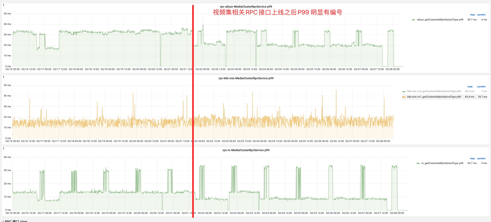

## work-plan-2023-02-20

### log-procesoor消费链路高可用

### 接入佩奇,佩奇实例化data mesh redisbean测试

1. 验证下固化开关的功能是否可用?
2. 佩奇生成新的redis bean做一个check
3. 上线预览后redis监控是否没有变动?

[medialib mr](https://git.intra.weibo.com/im/medialib/-/merge_requests/1841)
[confs配置](https://git.intra.weibo.com/platform/confs/-/merge_requests/8332)

### kafka 迁移 video_media,video_media_ai

[confs地址](https://git.intra.weibo.com/platform/confs/-/merge_requests/8328/diffs)

[medialib mr](https://git.intra.weibo.com/im/medialib/-/merge_requests/1840/diffs)

* media.playlist.kafka.dip.topic=video_playlist
    * QPS峰值: 40
    * 迁移方式,写个新的集群,停写旧集群
    * 写入集群如下：
* media.kafka.dip.topic=video_media
    * QPS峰值: 3k
    * 集群名称：kafka-dip-common
* media.kafka.ai.dip.topic=video_media_ai
    * QPS峰值: 5
    * 集群名称：kafka-dip-common

### jstack分析性能问题
> 本周无进展
> 背景: 尝试使用小工具分析线程or线程池链路上性能瓶颈在哪
1. 线程的状态有 `start` `runnable` `waiting` `time waiting` `BLOCKED` `终止`
2. 分析线上的某个线程池的状态
3. 列一个分析计划, 现成的依赖关系, 现成的状态,如何用统计的结论得到一个链路上繁忙与否的的信息?

### 媒体库核心链路数据流转

需要梳理出来发布一次视频,谁会调媒体库,怎么样掉媒体库? 哪些时机保存哪些消息

### 媒体库MySQL慢导致的slow
> 排期: 2月21号上线  -已上线

1. 媒体库放量Hikari数据库连接池数据 [form-媒体库切换连接池](https://git.intra.weibo.com/im/form/-/issues/7529)

2. 收益分析,分别以视频集上行和下行接口, output上下行接口做观察
慢查询监控:

#### userCluster: 从库QPS: 500 主库日常QPS:100

平均耗时: 从库变化不明显,主库 2.8ms->3.2ms 10%上涨

主库P99变化不明显

#### clusterItem: 端口: 9935-9942从 从库QPS: 300 主库日常QPS:100

- 从库平均耗时,慢查询,P99 

- 主库平均耗时上涨0.5ms,慢查询消失,P99 

#### ouput: 端口: 10037-10052从 从库QPS: 66-100 主库日常QPS:33-64

- 主库 从库 平均耗时都有上涨

- batchSaveOutputWithMediaId 接口P99

### output中处理snapshot防盗链处理上浮(建强)

* 对output中图片做防盗链处理在底层, 导致目前snapshot在替换视频的逻辑中会因为防盗链之后字符过长写入失败
* 和曾哥确认只有审核依赖, 将逻辑上浮到审核接口处
* 排期: 2月22号 - 加开关上线 

###  magma后台替换output bug修复(建强)
* 替换调用接口query过长,直接修改为使用媒体库replace接口(不替换input的话,会导致热门转码发起视频未替换)
* 新问题: 若旧视频发起过热门转码, 那么新mediaId依然会发起热门转码, 此时下载文件使用的是input中的`filemetaId`去作为转码的原始文件,所以必须重新修改input中才会生效
* replace v2版本逻辑确认
* 排期: 待定 修复完snapshot相关bug后再跟进

### video-ai 分类模型kafka消费下线 MCA
- 交接内容要梳理下
    - ASR要拉上丰腾一起
    - 排查问题也要一起
- system-video-recom-video-quality-output 未在使用
    - 机器学习分类数据 mca将mediaId写入redis,k8s定时任务地址[address](http://video.admin.intra.weibo.com/k8s/#!/cronjob/cronjob/mca-qascore-waic?namespace=cronjob)
- system-videorecom-video-classify-output 正常在消费写入多维库,目前无出口,下线时间待确定
union接口category吐出的数据是 diversity库中的分类信息

- videoTextAnalysis 这个topic的数据生成方式与videoFeatureAnalysis一样吗？

### 视频show_batch中在orgin 中新增md5数据:

背景: 饿了么正在通过adsapi做投承一体，主要是审核无误的素材直接传给超粉方便代理商投放使用

### 视频素材库新增游戏标签:
https://git.intra.weibo.com/im/dconfs-repo/-/merge_requests/2268