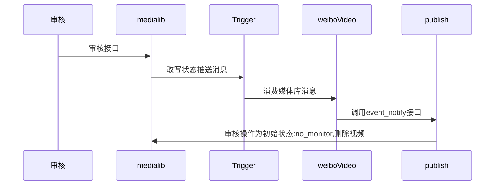

## work-plan-2023-08-01

### 媒体库支持首帧位置字段

- 开发完成,待上线

### 媒体库服务变慢问题排查

### pass平台故障演练

1. 首先以故障注入需要的参数为主
2. sdk架构设计,如何设计
3. 跑通一个demo,使用java clinet注入一个故障

### 媒体库审核对账

1. 现有逻辑熟悉
2. 对check逻辑增加用户是否被封禁的检查 `http://i.media.api.weibo.com/2/media/background/monitor_state/check.json` 

### 修改媒体库状态biz信息缓存不一致问题
1. 排查写主库,从主库reload到mc集群,异步构造并推trigger, biz信息不一致
2. publish还原DAG逻辑, 接到`event_notify`之后改写媒体库状态,防止无删除
3. 整个链路为: 

4. data mesh支持从mc主取数据 - 询问云鹏进度

### 媒体库三可用区
1. mc三机房资源 - 已完成  (15442 需上线)
2. redis三可用区 - data mesh 支持后,修改peppa后台

