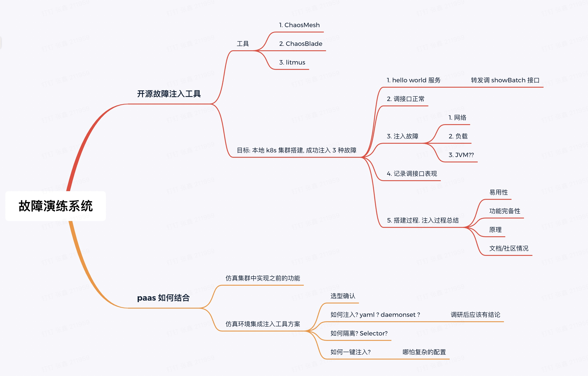
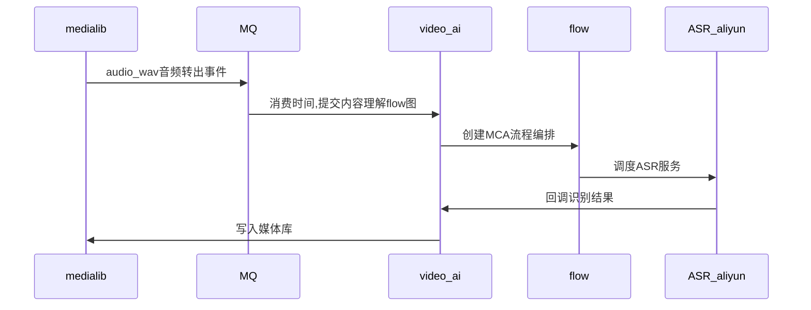
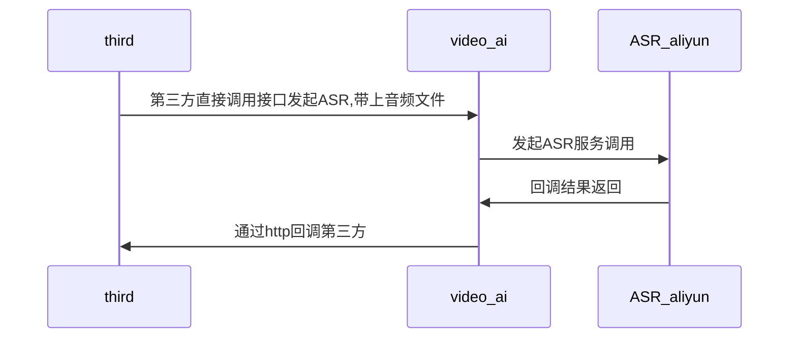
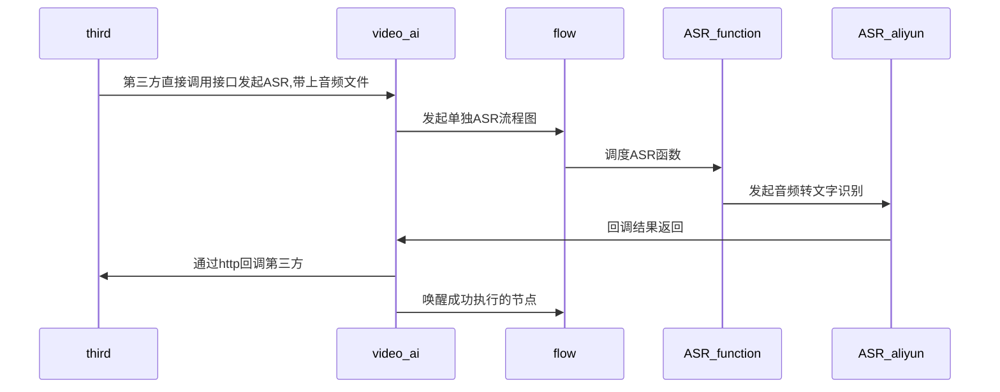

## work-plan-2023-07-10

### output新增dolby颜色相关字段

### pass平台故障演练

1. 熟悉k8s
2. 熟悉pass对k8s做了什么改造
3. 调研针对k8s上模拟故障的框架调研,如何用? 如何接入

### 客服接入ASR

> 需评估一个事件,什么时候能够全部交付? 可以把文档先给调用方调用

1. 梳理ASR目前的接入和使用现状
2. 首先上线ASR资源饱和度反馈接口供flow做换出使用 - 上线后如何接入饱和度概念?
3. 目前ASR发起, 回调流程 - normal,智能字幕,第三方
4. 第三方的ASR服务接入flow
    1. 掉接口 - 提交图, 发起ASR的执行
    2. ASR函数执行 - mcaFunction作为一个ASR的节点 - 可以做flow的换出操作
    3. video-ai接收结果,回调第三方,接口唤醒根据结果唤醒图 - 两个节点

5. [三可用区配置](https://git.intra.weibo.com/platform/confs/-/merge_requests/8955)

* 普通类型视频

https://weibo-fileplatform-public.oss-cn-beijing.aliyuncs.com/BroHXdOHlx07I4ht8BxS010f120024aY0E010.wav

http://10.182.10.187:8082/mca-asr-callback?privJobId=fecd15fa-3452-44b6-8293-d91812aff570

### 媒体库审核对账

1. 现有逻辑熟悉
2. 对check逻辑增加用户是否被封禁的检查 [mr](http://i.media.api.weibo.com/2/media/background/monitor_state/check.json) 

### 媒体库升级用户关系auth相关事项
1. 本周完成

用户关系rpc服务授权改造   和   

### 媒体库三可用区
1. mc三机房资源 - 已完成  (15442 需上线)
2. redis三可用区 - 采用一主三从,从域名每个可用区一个
 媒体库redis多可用区 - data mesh 支持后,修改peppa后台
 
 
 正文页视频banner视频播放记录 播放日志:

/data1/wb-plat-video_medialib-web/medialib-web-78c7d8b88b-dntg9/logs/2023_07_27/info.log.20230727-21.gz:[INFO] 20230727 21:27:21.594 [NettyServer-10.140.4.129:8004-7-thread-186] MediaOutputDAOImpl - batch save mediaOutputBean success, mediaOutputBean:MediaOutputBean(super=MediaFileBean(id=null, mediaId=4928227303686309, type=1, url=, fileId=, protocol=1, mime=, fileDetail={}, extension={}, createTime=null, updateTime=null, fileDetailValue=null, extensionValue=null), label=dash_hd, outputType=-1, state=2) 7ebada15-d1e6-4d33-874b-a90de35ead61

/data1/wb-plat-video_medialib-web/medialib-web-78c7d8b88b-dntg9/logs/2023_07_27/info.log.20230727-21.gz:[INFO] 20230727 21:27:21.594 [NettyServer-10.140.4.129:8004-7-thread-186] MediaOutputDAOImpl - batch save mediaOutputBean success, mediaOutputBean:MediaOutputBean(super=MediaFileBean(id=null, mediaId=4928227303686309, type=1, url=, fileId=, protocol=1, mime=, fileDetail={}, extension={}, createTime=null, updateTime=null, fileDetailValue=null, extensionValue=null), label=dash_hd, outputType=-1, state=2) 7ebada15-d1e6-4d33-874b-a90de35ead61
/data1/wb-plat-video_medialib-web/medialib-web-78c7d8b88b-dntg9/logs/2023_07_27/info.log.20230727-21.gz:[INFO] 20230727 21:27:52.893 [NettyServer-10.140.4.129:8004-7-thread-14] MediaOutputDAOImpl - batch update mediaOutputBean success, mediaOutputBean:MediaOutputBean(super=MediaFileBean(id=null, mediaId=4928227303686309, type=1, url=http://f.video.weibocdn.com/o0/t9OJwVxglx087lgWuOOI010412003jXY0E010.mp4?label=dash_hd&template=406x720.24.0, fileId=4928227546955805, protocol=1, mime=video/mp4, fileDetail={"rotate":0,"video_duration":22.583,"audio_duration":0.0,"bandwidth":280468,"sar":"0.0","quality_label":"480p","audio_channels":2,"fps":24.0,"bitrate":280468,"init_range":"0-1009","dolby_atmos":false,"video_codecs":"avc1.64001e","duration":22.583,"size":791738,"width":406,"index_range":"1010-1089","dolby_vision":false,"video_offset":"101168","audio_sample_rate":0,"first_segment_range":"1090-207798","height":720}, extension={}, createTime=2023-07-27 21:27:52.794, updateTime=2023-07-27 21:27:52.794, fileDetailValue=null, extensionValue=null), label=dash_hd, outputType=0, state=1) 623a9808-0298-4670-be2b-1d0253841f54