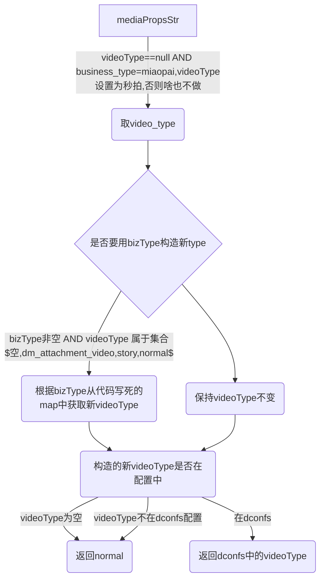

# 视频videoType和bizType修正

## 背景: 

本次起因是黑产刷量,`biz_type=oasis`,`video_type=normal`上传后一切正常,其中上传服务,publish服务在检查视频type的时候,都是使用的*校正videoType的SDK*,此组合最终判断该类型为normal视频类型,但是exchange是按照bizType优先级较高,写入对象库的是oasis类型的视频对象

## 如何解决?

1. 上传使用黑名单方式,拦截此类组合,目前已知 ("oasis,normal") - 风麟
2. 媒体库`initMedia()`将videoType保存起来,并以该type为准
3. 梳理仍在使用的不一致的业务方,梳理后列一个修改计划和对接人

## 校正SDK逻辑



- 8月10号状态为已发布的视频id
```
   1 live_qa live_replay_video live_qa
   1 media_business_video media_business_video media_business_video
   1 media_live edit_video media_live
   1 normal edit_video weibo_camera
   1 sobey video sobey
   1 video_type metabiztype metavideotype
   2 normal boot_video boot_video
   3 easub edit_video easub
   3 miaopai_third miaopai_exchange miaopai_exchange_video
   6 apple_clips video apple_clips
   9 douyu video douyu
  12 album_pay_video video album_pay_video
  19 media_live video media_live
  23 miaopai video miaopai
  78 album_pay_video album_pay_video album_pay_video
 119 pay_limit video pay_limit
1280 oasis_video oasis oasis_video
1933 easub video easub
3428 normal edit_video normal
571090 normal video normal
```
