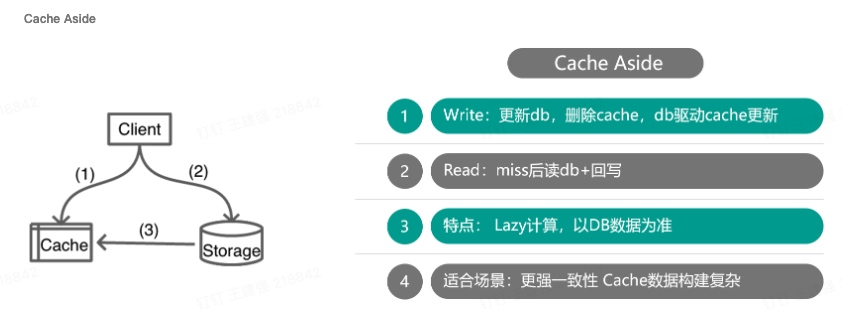
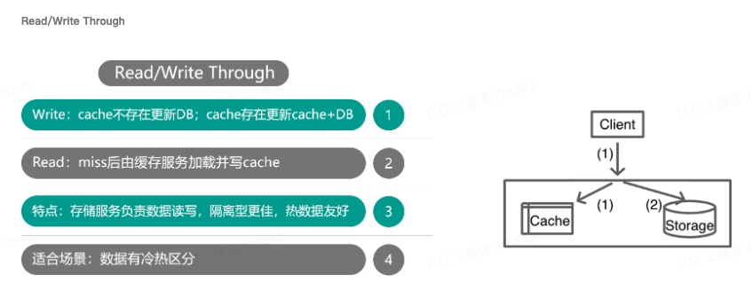
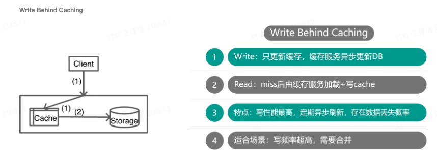

# Cache的总结

本文主要总结缓存的多种使用姿势,以及缓存的经典七大问题总结,分别给出了缓存在不同场景以及问题下的解决方案

## Cache的使用姿势总结

### 1. Cache Aside (旁路缓存)

写请求: 写入DB,删除缓存

读请求: miss后读DB,回写缓存

- 优点: 日常开发中经常使用的一种方式,采用写入DB,然后删除缓存(这种情况出现不一致的概率较低), 比较适合一致性要求较高的场景使用
- 缺点: 业务处理全部逻辑,写代码较复杂,较小概率出现不一致

### 2. Read Write Through (读写穿透)

写请求: 写DB,cache分两种情况, 存在则更新cache, 不存在忽略cache

写请求变种:写DB,从主库reload,写缓存缓存(CAS,缓存脏数据,重新reload)

读请求:

整个模式的特点是不需要关注 cache和DB之间的关系,对业务来讲封装为一套存储层

### 3. Write Behind Cacheing (异步缓存写入)

## Cache的七大经典问题

## 缓存穿透

## 缓存雪崩

## 缓存